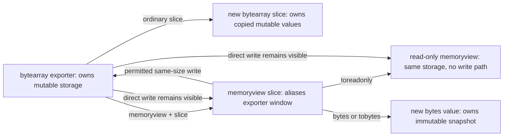
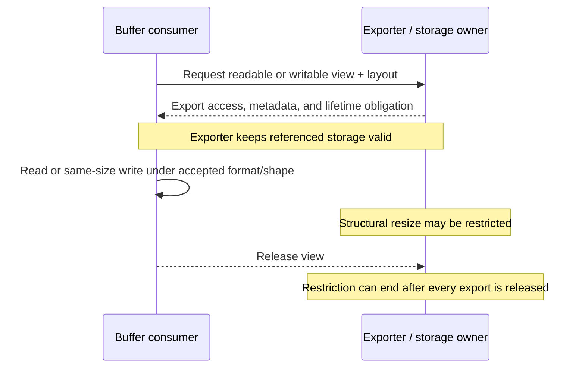

# PY-BLT-030 — Bytes, bytearray, memoryview, and the buffer model

[Curriculum entry](../../../CURRICULUM.md#py-blt-030) · [Progress](../../../PROGRESS.md) · Local branch: `topic/PY-BLT-030`

## Physical Notebook Core

### Problem this concept solves

Programs must represent encoded text, protocol fields, file contents, compressed data, images, and other octets without confusing them with Unicode text, while choosing deliberately between immutable values, mutable storage, copied slices, and shared views.

### One-sentence mental model

> `bytes` is an immutable byte-value sequence, `bytearray` is mutable byte-owning storage, and `memoryview` is a typed, shaped, permission-bearing window onto storage exported by another object.

### One important visual

```text
text domain                         binary domain
"Aé" ── encode UTF-8 ──> b"A\xc3\xa9" ──> bytearray(...) owns mutable copy
  ^                             │                         │
  └──── decode UTF-8 ───────────┘                         ├── slice ──> copy
                                                        └── memoryview ──> alias

owner/storage       bytearray [48][45][41][44][2a][2a][2a][2a]
view/interpretation                          ^-----------^
                                             same storage, no snapshot
```

#### How to read this visual

Read the top line across an explicit encoding boundary: Unicode text becomes a sequence of byte values and can later be decoded only under the same named policy. Then read the two `bytearray` branches: an ordinary slice owns copied values, while a `memoryview` describes a window whose reads and permitted writes reach the exporter's storage.

#### Key insight

The visible byte values do not reveal ownership. Correct binary APIs must state representation, mutability, copy versus alias behavior, layout, and view lifetime separately.

#### Simplification or limitation

The boxes are conceptual byte positions, not literal CPython object headers, addresses, or allocator layout. The visual omits multi-byte element formats, shapes, strides, non-contiguous views, compression, streaming, synchronization, and exporter-specific resource rules.

### Governing rules or invariants

1. Text and binary data are distinct domains: cross them only with an explicit encoding and error policy.
2. `bytes` and `bytearray` index to integers in `0..255`; their slices produce binary sequences, not integers.
3. `bytes` is immutable; `bytearray` supports same-size mutation and resizing, subject to valid values and live-export restrictions.
4. An ordinary `bytes` or `bytearray` slice owns a result; a `memoryview` slice is another view of exporter-owned storage.
5. Read-only means “cannot write through this view,” not “frozen snapshot”; later exporter mutation can remain visible.
6. `len(view)` counts top-level logical elements, while `view.nbytes` counts logical data bytes; `format`, `itemsize`, `shape`, and `strides` define how to interpret them.
7. Consumers may require readable or writable, contiguous or structured buffers. Check the exact consumer contract instead of assuming every buffer-shaped object is accepted.
8. Release views promptly when their lifetime matters; an exporter such as `bytearray` may forbid resizing while any view remains live.

### Minimal example

```python
data = bytearray(b"abcdef")
copied = data[1:4]
view = memoryview(data)[1:4]

view[0] = ord("X")
data[2] = ord("Y")

print(data)           # bytearray(b'aXYdef')
print(copied)         # bytearray(b'bcd')
print(view.tobytes()) # b'XYd'

view.release()
```

Expected reasoning:

1. `copied` owns the values selected when the ordinary slice ran, so later writes do not reach it.
2. `view` retains a window onto positions 1 through 3 of `data`; writes in either direction are visible through the other handle.
3. `tobytes()` creates an immutable value snapshot for printing, while `release()` ends this view's access and export lifetime.

### One failure or misconception

**Mistake:** treating `memoryview(data).toreadonly()` as a frozen, thread-safe snapshot that can be retained indefinitely.

**Correction:** the derived view forbids writes through itself but can still expose later writes made through another alias. If independent stable ownership is required, make an intentional copy such as `bytes(view)` at the ownership boundary and accept its memory cost.

### Important trade-offs

- `bytes` gives stable immutable value semantics and hashability but every changed value requires a new binary object.
- `bytearray` supports efficient staged construction and in-place updates but exposes mutation and live-view lifetime hazards.
- `memoryview` can avoid copying large regions and preserve structured metadata, but it couples consumers to exporter lifetime, mutability, and accepted layout.
- Copying can be the correct design at an asynchronous, trust, caching, or ownership boundary; “zero copy” is not a correctness property.
- Native multi-byte formats are convenient inside one process; external protocols should state byte order, sizes, alignment, and length validation explicitly.

### Interview-revision cues

- Say “immutable byte sequence, mutable byte-owning sequence, exporter-backed view,” then name copy and alias behavior.
- Predict integer indexing, same-type slicing, mutation visibility, `len` versus `nbytes`, resize failures, and post-release failures.
- Explain why read-only is a permission, why UTF-8 length is a byte count, and when an intentional copy is safer than a retained view.

## Unit metadata

| Field | Value |
|---|---|
| Domain | Built-in types, operations, and functions |
| Canonical ID | `PY-BLT-030` |
| Learning outcome | Use `bytes`, `bytearray`, `memoryview`, and the buffer model; distinguish text from binary data |
| Hard prerequisites | `PY-BLT-020`, `PY-FND-020` |
| Soft prerequisites | None |
| Co-requisites | None |
| Priority | Professional |
| Interview frequency | Medium |
| Backend relevance | High |
| Depth | D2 |
| Scope | Language, Standard library |
| Size | L |
| Evidence profile | E+C+X |
| Canonical Python | Python 3.14 |
| Interview compatibility | Python 3.11 |
| Initially tested runtime | CPython 3.14.4 on Linux x86_64 |
| Last source audit | 2026-08-29 |
| Artifact state | Draft |

## 1. Learning outcome and evidence

After this unit, the learner should be able to:

1. Keep Unicode text and binary data separate, choosing explicit encode/decode boundaries, encodings, error policies, and size units.
2. Predict construction, literal, integer-index, slice, containment, comparison, hexadecimal, and mutation behavior for `bytes` and `bytearray`.
3. Distinguish owning copies, mutable aliases, immutable snapshots, and read-only views without relying on addresses or CPython accidents.
4. Explain the exporter/consumer buffer model and inspect public view metadata: format, item size, dimensions, shape, strides, byte count, contiguity, and write permission.
5. Use `memoryview` slicing, `cast`, `tobytes`, `toreadonly`, context management, and `release` with correct lifetime and layout constraints.
6. Parse and build a bounded binary protocol with explicit byte order, declared-length checks, complete-frame validation, malformed-text handling, and deterministic resource release.
7. Decide whether to copy or retain a view at backend, storage, asynchronous, security, and interoperability boundaries, stating memory and coupling trade-offs honestly.

Required evidence for `E+C+X`:

- **E — Explain:** reconstruct the ownership visual and explain text/binary conversion, integer versus slice results, copy versus alias behavior, read-only visibility, metadata, contiguity, and release.
- **C — Code:** implement a bounded buffer-consuming binary parser and a writable fixed-size transformation with deterministic tests for all supported exporters, malformed input, non-contiguous layout, mutability, size limits, and cleanup.
- **X — Experiment:** predict and reproduce copy/view mutation visibility, read-only aliasing, resize restriction, release invalidation, shape/cast metadata, and strided non-contiguity on a version-labelled runtime.

The included [binary protocol](examples/binary_protocol.py), [buffer operations](examples/buffer_operations.py), [focused tests](tests/test_examples.py), [protected practice](practice/README.md), and [reproduced experiment](experiments/EXP-01-aliasing-metadata-and-view-lifetime/README.md) support those targets. Generated canonical materials do not constitute learner evidence.

## 2. Prerequisite bridge

The tracker records both hard prerequisites as `Not started`, although their canonical artifacts are approved. The following bridge is enough to begin this unit; it does not complete either prerequisite.

| Type | Unit | Why it matters | Minimum bridge |
|---|---|---|---|
| Hard | `PY-BLT-020` — Strings and Unicode | Encoding maps Unicode text to bytes, decoding maps bytes to Unicode text, and code-point length can differ from encoded byte length. | Treat `str` as Unicode text and `bytes` as encoded or otherwise binary values. Cross the boundary with a named encoding and error policy; `str(binary)` without an encoding is representation, not decoding. |
| Hard | `PY-FND-020` — Objects, names, references, and mutability | Copies, aliases, immutable values, mutable exporters, and view lifetime all depend on separating a name from the object and storage it references. | A name refers to an object. Rebinding is not mutation. Two objects may hold equal values without sharing storage; two handles may expose the same mutable storage. `is` cannot replace a documented ownership contract. |

Recommended dedicated review: revisit `PY-BLT-020` and `PY-FND-020` before claiming learning evidence for this unit.

## 3. Vocabulary and professional English

### Binary

| Item | Content |
|---|---|
| Pronunciation | BY-nuh-ree |
| Simple English meaning | Represented or handled as discrete base-two data rather than human language |
| Hindi cue | द्विआधारी डेटा |
| Meaning in this Python context | A sequence or structured region of byte values whose meaning comes from an external format or protocol |

Natural examples:

1. The request body remains binary until the protocol identifies a text field.
2. A PNG signature is binary data even though diagnostics may display it in hexadecimal.
3. The parser validates the binary header before allocating space for its payload.
4. **Interview:** “`bytes` is a binary sequence whose integer elements are in the range zero through 255.”
5. **Engineering discussion:** “The API must distinguish a binary checksum from its hexadecimal text representation.”

### Encode

| Item | Content |
|---|---|
| Pronunciation | en-KOHD |
| Simple English meaning | Convert information into a chosen representation |
| Hindi cue | चुने हुए रूप में बदलना |
| Meaning in this Python context | Map Unicode text to bytes under a named character encoding and error policy |

Natural examples:

1. Encode the label as UTF-8 only after text validation.
2. The encoded payload occupies more bytes than the string has code points.
3. A protocol version should define the encoding rather than rely on a machine default.
4. **Interview:** “Encoding goes from `str` to `bytes`; decoding crosses in the opposite direction.”
5. **Engineering discussion:** “We reject unencodable text instead of silently replacing characters in an identifier.”

### Contiguous

| Item | Content |
|---|---|
| Pronunciation | kuhn-TIG-yoo-us |
| Simple English meaning | Placed next to each other without gaps |
| Hindi cue | लगातार / बिना अंतर |
| Meaning in this Python context | A buffer layout whose logical elements occupy an accepted adjacent C-style or Fortran-style memory order |

Natural examples:

1. The step-two view is not contiguous because logical neighbors are two bytes apart.
2. This consumer requires a C-contiguous input before casting it to octets.
3. A contiguous logical view can still expose multi-byte elements.
4. **Interview:** “Buffer support alone does not guarantee that a consumer accepts the exporter's contiguity or format.”
5. **Engineering discussion:** “We either reject the strided view or make one documented contiguous copy at the library boundary.”

### Alias

| Item | Content |
|---|---|
| Pronunciation | AY-lee-us |
| Simple English meaning | Another handle or name for the same underlying thing |
| Hindi cue | उसी वस्तु का दूसरा संदर्भ |
| Meaning in this Python context | A view or reference through which the same exporter-owned storage can be observed and sometimes mutated |

Natural examples:

1. The sliced memoryview aliases four bytes in the original `bytearray`.
2. A copied `bytes` value is a snapshot, not an alias.
3. The read-only alias still observes writes performed through a writable handle.
4. **Interview:** “Read-only access removes one mutation path; it does not remove aliasing.”
5. **Engineering discussion:** “The worker must receive owned immutable bytes because retaining an alias would cross the request lifetime.”

## 4. Deep explanation

### 4.1 Start with the semantic domain, not the container

The same byte values can mean a UTF-8 word, a compressed block, an integer field, a checksum, a pixel, an encrypted record, or nothing valid. Python cannot infer that meaning from `b"..."`. The protocol or application contract must specify:

1. where the binary value begins and ends;
2. whether any region represents text and under which encoding;
3. byte order, field widths, signedness, alignment, and version;
4. whether mutation is permitted and who owns it;
5. maximum accepted and produced sizes;
6. whether a consumer accepts a general buffer, requires contiguous bytes, or requires an immutable `bytes` object;
7. how long exporter-backed views may remain valid.

Python's standard-library documentation calls `bytes` and `bytearray` the core built-in types for binary data and describes `memoryview` as access through the buffer protocol without needing an intermediate copy. That is a representation and access model, not a file-format parser or security policy. See [Binary Sequence Types](https://docs.python.org/3.14/library/stdtypes.html#binary-sequence-types-bytes-bytearray-memoryview) and [Buffer Protocol](https://docs.python.org/3.14/c-api/buffer.html).

### 4.2 `bytes`: immutable byte-value sequences

A `bytes` object is an immutable sequence of single-byte integer values. Integer indexing returns an `int`; slicing returns `bytes`:

```python
packet = b"A\x00\xff"

packet[0]       # 65
packet[-1]      # 255
packet[:1]      # b"A"
65 in packet    # True: integer element containment
b"A" in packet # True: binary subsequence containment
```

This differs from `str`, whose integer indexing returns a length-one `str`. The difference matters in arithmetic, formatting, membership tests, iteration, and parser code.

Bytes literals permit ASCII source characters directly. Values above 127 must be expressed with escapes such as `b"\xc3\xa9"`; writing `b"é"` is a syntax error. The restriction makes it harder to mistake source-code glyphs for a binary encoding.

The constructor has several distinct contracts:

```python
bytes(3)                  # b"\x00\x00\x00": size, not text "3"
bytes([65, 0, 255])       # b"A\x00\xff": iterable of byte values
bytes("é", "utf-8")     # b"\xc3\xa9": explicit text encoding
bytes(memoryview(b"xy")) # b"xy": immutable copy from a buffer exporter
```

Every integer element must be in `0..255`. `bytes.fromhex()` parses two hexadecimal digits per byte, and `.hex()` returns a textual hexadecimal representation. In Python 3.14, `fromhex()` additionally accepts ASCII bytes-like input; Python 3.11 requires a `str` input.

Because bytes are immutable, operations that appear transformational—`replace`, `strip`, `upper`, concatenation, and slicing—produce binary values rather than mutating the receiver. Immutable stable values can be hashed and used as dictionary keys. Repeatedly appending immutable chunks with `result += chunk` can repeatedly allocate and copy; use a list plus `b"".join`, `io.BytesIO`, a deliberate `bytearray`, or a streaming sink according to the construction contract.

Several bytes methods resemble string methods because many protocols contain ASCII-compatible regions. The documentation warns against blindly applying text-oriented algorithms to arbitrary binary formats. `payload.lower()` has no general meaning for compressed, encrypted, numeric, or image bytes.

### 4.3 `bytearray`: mutable byte-owning storage

`bytearray` represents a mutable sequence of byte values and supports most `bytes` operations plus mutable-sequence operations:

```python
data = bytearray(b"ABC")
data[0] = 90          # one integer byte value
data[1:3] = b"xy"    # equal-size replacement
data.extend(b"!")    # resize
del data[-1]          # resize
```

Integer assignment requires a value from zero through 255. Slice assignment consumes a suitable iterable of byte values and can resize when the assigned slice and input lengths differ. Appending, extending, inserting, deleting, clearing, repetition, and the Python 3.14 `resize()` method also change length.

An ordinary slice produces another `bytearray` with independent storage:

```python
source = bytearray(b"abcdef")
part = source[1:4]
source[1] = ord("X")

part  # bytearray(b"bcd")
```

The equal initial content does not establish aliasing. The copied result is useful when a component needs independent mutable ownership, but the copy has memory and time costs proportional to the copied region.

Method names do not prove in-place behavior. Many bytearray methods shared with `bytes`, including `.upper()`, `.replace()`, `.strip()`, and `.removeprefix()`, return new objects even when no byte changes. Explicit item/slice assignment and mutable-sequence methods are clearer signals of mutation.

When a `bytearray` exports live views, same-size mutation remains possible, but resizing is temporarily forbidden because moving or changing the storage could invalidate consumers. Release every relevant view before resizing. The exact restrictions of third-party exporters may differ.

### 4.4 The buffer model: exporter, view, and consumer

The buffer protocol separates three roles:

- an **exporter** owns or manages storage and describes its accessible data;
- a **view** carries access, layout, element-format, and lifetime information;
- a **consumer** requests a layout and reads or writes according to its own contract.

Built-in exporters include `bytes`, `bytearray`, and `array.array`. File writes, `readinto()`-style APIs, `struct`, hashing libraries, compression libraries, sockets, and third-party numerical or image libraries may consume buffers with different requirements.

At Python level, `memoryview(exporter)` is the general view object. It keeps the relevant export alive and exposes public metadata. It does not promise that every operation is zero-allocation, and it does not make an incompatible consumer accept a strided or structured view.

```python
data = bytearray(b"abcdef")
view = memoryview(data)
window = view[1:4]

window[0] = ord("X")
data  # bytearray(b"aXcdef")
```

One-dimensional memoryview slicing returns a subview. It does not copy the referenced data. If the exporter permits writes, assignment through a compatible view updates storage, but memoryview assignment cannot resize: source and destination structures must match.

`memoryview(bytes_value)` is normally read-only because immutable bytes cannot supply writable storage. `memoryview(bytearray_value)` is writable. `view.toreadonly()` returns another view with writes disabled, but both views still reach the same exporter. If stable independent bytes are required, `view.tobytes()` or `bytes(view)` creates a copy.

The C API documentation describes buffer acquisition and release as paired operations. Python's `memoryview.release()` and context manager express that lifetime at a higher level. After release, operations other than another `release()` fail. Prompt release matters because exporters may retain resources or temporarily forbid structural mutation. See [Memory Views](https://docs.python.org/3.14/library/stdtypes.html#memory-views).

### 4.5 Element format, byte count, shape, strides, and contiguity

A buffer is not necessarily a flat sequence of one-byte elements. `array('H')`, for example, exports native unsigned-short elements whose item size is platform-dependent:

```python
from array import array

words = array("H", [1, 256, 513])
view = memoryview(words)

len(view)       # 3 logical elements
view.itemsize   # bytes per H element on this runtime
view.nbytes     # 3 * itemsize
view.format     # "H"
view.shape      # (3,)
view.strides    # byte distance between logical neighbors
```

Use the attributes precisely:

| Attribute | Question answered |
|---|---|
| `format` | How is one logical element interpreted, using `struct`-style format notation? |
| `itemsize` | How many bytes does one element occupy? |
| `ndim` | How many logical dimensions are exposed? |
| `shape` | How many elements occur along each dimension? |
| `strides` | How many bytes must be stepped along each dimension to reach the next element? |
| `nbytes` | How many logical data bytes would the view contain in a contiguous representation? |
| `readonly` | May this view be used for writes? |
| `c_contiguous`, `f_contiguous`, `contiguous` | Does the logical layout meet a documented adjacent-memory order? |

For public memoryviews, `nbytes == product(shape) * itemsize == len(view.tobytes())`. It need not equal `len(view)`, because `len` counts top-level elements. For a 2-by-4 byte matrix, `len(view)` is 2 while `nbytes` is 8. For a multi-byte one-dimensional array, three elements can occupy six, twelve, or another platform-defined byte count.

Slicing with a step can create a non-contiguous view:

```python
view = memoryview(b"abcdefgh")[::2]

view.tobytes()     # b"aceg"
view.strides       # (2,) for this byte exporter
view.c_contiguous  # False
```

The logical values are four bytes; the physical span contains skipped positions. Consumers that require C-contiguous input may reject this view. Making `bytes(view)` would create a contiguous immutable copy, which can be a valid adapter only when the copy and ownership change are acceptable.

`view.cast(format, shape)` returns a new view that reinterprets the same buffer. The documented casts require an equal total byte length, supported native single-element formats, a byte format on one side, and compatible C-contiguity/dimensionality. A cast does not perform byte-order conversion or validation of an external protocol; native multi-byte formats can be platform-specific.

### 4.6 Conversion, equality, hashing, and snapshots

These operations answer different questions:

```python
view.tobytes()    # immutable byte copy in requested order
bytes(view)       # equivalent immutable byte copy for ordinary use
view.tolist()     # nested Python values interpreted by format and shape
view.hex()        # textual hexadecimal representation
view.toreadonly() # another alias with write permission removed
```

`tobytes`, `bytes`, `tolist`, and `hex` materialize new representations. `toreadonly` does not copy the underlying storage.

Memoryview equality compares logical array values with shape and supported format interpretation rather than blindly comparing raw storage bytes. This can be useful but should not replace a protocol-specific comparison when padding, endianness, canonical serialization, timing sensitivity, or authentication matters.

Hashing is deliberately narrow: one-dimensional read-only memoryviews with formats `B`, `b`, or `c` over hashable exporters can be hashable, with a hash matching their byte value. A writable view is not a stable dictionary key. Converting to immutable `bytes` makes ownership and key semantics more obvious for most application code.

### 4.7 Text and binary conversion boundaries

`str` is not “more readable bytes,” and `bytes` is not “a string with a prefix.” Encoding and decoding are semantic conversions:

```python
text = "café"
payload = text.encode("utf-8", errors="strict")
restored = payload.decode("utf-8", errors="strict")
```

The text has four code points and the UTF-8 payload has five bytes. A binary protocol length field normally counts encoded bytes, not Python code points, unless its specification says otherwise.

`str(payload)` without an encoding produces an informal representation such as `"b'caf\\xc3\\xa9'"`; it does not decode. Conversely, decoding arbitrary binary data merely because some bytes resemble ASCII can corrupt semantics or raise an error. Only a field defined as text should be decoded.

Error handlers are part of the boundary. `strict` preserves failure information. `ignore` silently discards invalid input; `replace` changes it. Either non-strict policy requires a domain reason and tests, especially for identifiers, signatures, lengths, audit fields, and security-sensitive protocols.

When a view contains encoded text, `str(view, "utf-8", "strict")` can consume a bytes-like object directly, or application code can intentionally snapshot with `bytes(view).decode(...)`. Choose based on ownership and API clarity, not by hiding the conversion.

### 4.8 Bounded protocol parsing

External binary data is untrusted structure. A safe parser establishes cheap bounds before expensive copies or allocations:

1. acquire a readable view and validate required contiguity;
2. ensure the fixed header is present;
3. parse magic, version, flags, byte order, and declared sizes;
4. reject unsupported versions and reserved bits;
5. compare declared sizes with configured limits before materializing payloads;
6. require exact available length or apply a documented streaming/framing policy;
7. verify checksums, authentication tags, or signatures according to their distinct contracts;
8. decode only fields defined as text;
9. release temporary views on every path;
10. return values whose ownership and lifetime are explicit.

The `struct` module supports external data exchange and accepts appropriate buffer exporters. Its default native mode uses platform byte order, C sizes, and alignment, so external protocols should use an explicit prefix such as `!`, `>`, or `<` and defined padding. `unpack_from` can inspect a header without first slicing it into a new `bytes` object. See [`struct` — Byte Order, Size, and Alignment](https://docs.python.org/3.14/library/struct.html#byte-order-size-and-alignment).

The included protocol uses `!BH`: one version byte followed by one two-byte unsigned length in network order. It validates exact total length before copying payload bytes into the returned text value. This is a teaching protocol, not a claim that a real service should buffer an entire message.

### 4.9 Python-level exporters and typing

Historically, most exporter types were implemented in C. Python 3.12 made the buffer protocol accessible to Python classes through `__buffer__` and optional `__release_buffer__`, and added `collections.abc.Buffer`. The special methods must preserve storage validity and resource-release rules; they are not a casual replacement for returning `bytes`.

`collections.abc.Buffer` is useful for runtime checks and annotations in Python 3.12+. In Python 3.11-compatible code, annotate the explicit supported types or accept `object` and attempt `memoryview(value)` at the boundary. The latter tests the capability the consumer actually needs and avoids pretending that `collections.abc.ByteString` covers `memoryview` or other exporters. See [PEP 688](https://peps.python.org/pep-0688/) and [`collections.abc.Buffer`](https://docs.python.org/3.14/library/collections.abc.html#collections.abc.Buffer).

Python 3.14 additionally makes `memoryview` subscriptable as a generic type for annotations. Runtime buffer behavior is not changed by an annotation, and Python 3.11 code must keep the type unparameterized or use another compatible typing strategy.

### 4.10 Execution sequence for the included frame decoder

| Step | Event | Relevant state |
|---:|---|---|
| 1 | `memoryview(data)` requests a buffer | The caller retains ownership; the decoder owns one temporary view |
| 2 | Decoder checks `c_contiguous` | Unsupported layout fails before header interpretation |
| 3 | View is cast to unsigned bytes | Same exported storage, one-byte logical elements, no payload copy yet |
| 4 | `struct.Struct("!BH").unpack_from` reads header | Version and declared payload byte count become Python integers |
| 5 | Decoder compares version and exact total `nbytes` | Truncation and trailing data fail before text construction |
| 6 | Payload subview is decoded as strict UTF-8 | A new `str` is intentionally created at the declared text boundary |
| 7 | Payload, byte view, and original view are released | Decoder retains no alias to caller-owned storage |
| 8 | Frozen `TextFrame` is returned | Result owns text and scalar metadata independent of input mutation |

## 5. Additional visual models

### Copy, view, and snapshot ownership



#### How to read this visual

Start at the exporter. Solid outward arrows label the operation used to produce each handle. The two arrows between exporter and writable view show shared mutation visibility. The read-only branch removes writes through that handle but retains the arrow from exporter. The `bytes` branch is a separate owned snapshot with no return arrow.

#### Key insight

Mutability, write permission, ownership, and observation are independent axes: immutable snapshot, independent mutable copy, writable alias, and read-only alias are four distinct states.

#### Simplification or limitation

This is a language-level ownership model, not an allocation count or CPython pointer graph. Operations may create metadata objects, and third-party exporters can impose additional lifetime and layout rules.

### Export request and release lifetime



#### How to read this visual

Read downward in time. The consumer requests a capability, the exporter supplies access plus metadata, and both remain coupled until release. The middle notes describe the lifetime invariant rather than a method call.

#### Key insight

A view is a temporary capability with obligations on both sides: the exporter must keep storage valid, and the consumer must obey permissions, layout, and release lifetime.

#### Simplification or limitation

The diagram merges Python-level `memoryview` operations with the general protocol model. It omits C request flags, chained exporters, multiple simultaneous views, error paths, external resources, suboffsets, and free-threaded synchronization requirements.

### Framed text layout

```text
byte offset     0             1             2             3 ...
             +---------+-------------+------------------------------+
field        | version | payload byte length (big-endian unsigned)  | UTF-8 payload
size         | 1 byte  | 2 bytes                                  | N bytes
             +---------+-------------+------------------------------+

"Aé"        code points = 2
UTF-8        payload bytes = 3: 41 c3 a9
frame        01 00 03 41 c3 a9
```

#### How to read this visual

Read the frame left to right. The first byte selects the protocol version, the next two bytes declare payload length in network order, and exactly that many bytes follow. Then compare the text count with the encoded payload count.

#### Key insight

Length belongs to a specified representation. A text length of two does not justify writing two into a field defined as UTF-8 byte length.

#### Simplification or limitation

This synthetic frame omits magic bytes, flags, checksums, authentication, streaming, compression, partial reads, and maximum-message negotiation. It exists only to isolate byte length and buffer parsing.

## 6. Worked examples

### 6.1 Small example — exact text/binary boundary

The [binary protocol example](examples/binary_protocol.py) runs:

```python
text = "A\u00e9"
encoded = encode_text_frame(text)
decoded = decode_text_frame(encoded)
```

Prediction before execution:

`text` contains two code points. UTF-8 represents `A` with one byte and `é` with two, so the header declares three payload bytes and the complete frame contains six bytes. Strict decoding reconstructs the original text.

Observed on CPython 3.14.4:

```text
text: value='Aé'; code-points=2
frame: hex=01000341c3a9; bytes=6
decoded: TextFrame(version=1, text='Aé', payload_size=3)
```

### 6.2 Realistic backend example — validate before materializing

The frame decoder accepts several readable exporters without converting the complete input first:

```python
encoded = encode_text_frame("ready")

decode_text_frame(encoded)
decode_text_frame(bytearray(encoded))
decode_text_frame(memoryview(encoded))
```

Its boundary policy is explicit:

- only C-contiguous exported input is accepted;
- the three-byte header must be present;
- version must equal one;
- actual bytes after the header must exactly equal the declared count;
- payload is strict UTF-8;
- payload conversion creates owned text only after structural validation;
- every temporary view is released on success and failure.

Why this design fits:

- buffer acquisition avoids an unconditional full-input `bytes(data)` copy;
- `nbytes` remains correct for a contiguous multi-byte exporter;
- `!BH` fixes byte order, field sizes, and padding independently of the host;
- exact total length prevents silent truncation and ignored trailing data;
- the frozen return value does not retain an alias to caller-owned mutable input.

Alternatives and failure modes:

- a streaming protocol should retain incremental parser state rather than require one complete frame;
- a real protocol needs a configured maximum before trusting a length field, even if the header width already gives a theoretical maximum;
- returning a payload view can avoid a copy but transfers exporter lifetime and mutation risks into the public API;
- copying first simplifies ownership but can amplify attacker-controlled memory use;
- a checksum detects some accidental corruption but does not authenticate an untrusted message;
- native `struct` mode would make an external frame platform-dependent.

### 6.3 Mutable buffer example — copy beside alias

The [buffer operation example](examples/buffer_operations.py) preserves a copied slice and mutates through a view:

```python
data = bytearray(b"HEADsecretTAIL")
copied = data[4:10]
view = memoryview(data)[4:10]
view[0] = ord("S")
```

Observed on CPython 3.14.4:

```text
after-view-write: exporter=bytearray(b'HEADSecretTAIL'); copy=bytearray(b'secret')
after-overwrite: exporter=bytearray(b'HEAD******TAIL'); checksum=56
metadata: BufferInfo(format='B', itemsize=1, ndim=1, shape=(14,), strides=(1,), nbytes=14, readonly=False, c_contiguous=True)
```

The fixed-size overwrite makes mutation ownership visible and never changes exporter length. The copied slice remains an independent record of the earlier values.

### 6.4 Debugging example — attempt before requesting a hint

Do not correct this implementation yet:

```python
def attach_checksum(data: bytearray) -> memoryview:
    payload = memoryview(data).toreadonly()
    checksum = sum(payload) % 256
    data.append(checksum)
    return payload
```

Investigate in this order:

1. Predict whether “read-only” changes the exporter's resize restriction.
2. Identify who would own the returned view and how long the exporter must remain valid.
3. Decide whether the caller requires a pre-checksum snapshot, a view of the final message, or an owned immutable value.
4. State the smallest input that exposes the first failure and preserve the original attempt before requesting one hint.

## 7. Edge cases and misconceptions

| Mistake or edge case | Why it seems plausible | Correct model | How to expose it |
|---|---|---|---|
| `bytes(index)` converts an integer to decimal text | Numeric constructors often parse or format numbers | An integer argument is a zero-filled length | Compare `bytes(3)` with `str(3).encode("ascii")` |
| Byte indexing returns a one-byte `bytes` | String indexing returns a length-one string | `bytes[i]` and `bytearray[i]` return `int`; slices return binary sequences | Compare types of `b"A"[0]` and `b"A"[:1]` |
| Every integer iterable is accepted | Elements look numeric | Each produced element must be in `0..255` and integer-like | Try negative, 256, float, and `bool` inputs deliberately |
| A bytes literal can contain any source glyph | Python source is Unicode | Direct bytes-literal characters are restricted to ASCII; use escapes or encode text | Attempt `b"é"` and compare with `"é".encode("utf-8")` |
| `str(binary)` decodes | The returned value is a string | Without encoding arguments, it returns an informal representation | Compare `str(b"A")` with `b"A".decode("ascii")` |
| `bytearray.upper()` mutates | The receiver is mutable | Many text-like bytearray methods still return new values | Retain receiver and result and compare both |
| A `bytearray` slice is a view | Both values are mutable | Ordinary slice creates an independent `bytearray` | Mutate source and slice in both directions |
| A memoryview slice is a copy | Slicing `bytes` and `bytearray` copies values | One-dimensional memoryview slicing creates a subview | Write through a writable window and inspect exporter |
| `toreadonly()` freezes values | “Read-only” sounds immutable | It only removes writes through that view; exporter changes remain visible | Mutate through original exporter and read derived view |
| `readonly` means hashable | Immutable access seems stable | Hashability has stricter dimension, format, and exporter requirements | Hash writable, read-only byte, and structured views separately |
| Any buffer can be cast | Cast sounds like metadata-only reinterpretation | Format, one-byte side, byte length, dimension, and C-contiguity rules apply | Try casting a step-sliced view or unequal byte size |
| `len(view)` is the byte count | It is true for one-dimensional byte views | It counts top-level logical elements; use `nbytes` for logical byte count | View `array('H')` and a 2-by-4 byte cast |
| `nbytes` is physical span | The name sounds like allocation size | It counts logical data bytes in a contiguous representation, not skipped span or exporter allocation | Compare a step-two view's `nbytes`, strides, and exporter length |
| Buffer support guarantees consumer acceptance | The object successfully creates a memoryview | Consumers request specific writability, format, and contiguity | Pass a non-contiguous view to a C-contiguous consumer |
| A memoryview can resize its exporter | It can mutate visible bytes | Assignment structure must match; resizing is not allowed through a view | Assign four bytes into a one-byte view slice |
| Releasing the root releases every derived view | Views feel like one handle hierarchy | Each live export/view retains its own valid lifetime as documented by the exporter | Keep a derived view, release another handle, and test resize/access carefully |
| Zero-copy is always faster and safer | Fewer copies sounds universally better | It can lengthen retention, couple lifetimes, expose mutation, or force layout handling | Review an async handoff with a large pooled buffer |
| Native `struct` layout is a network format | It works locally | Native mode depends on platform byte order, sizes, and alignment | Compare `@I`, `!I`, sizes, and serialized bytes |
| A checksum authenticates data | Both detect some changes | Ordinary checksums are not cryptographic authenticity or authorization | Modify payload and recompute the checksum |
| `errors="ignore"` repairs malformed UTF-8 | Decoding succeeds | It silently discards bytes and can change identifiers, lengths, or signatures | Decode an invalid byte inside a structured field |

## 8. Complexity and performance

| Operation or design | Typical complexity or cost | Qualification |
|---|---:|---|
| `len(binary)` or byte indexing | Constant-time on CPython | The language documents the result, not a universal cross-implementation big-O guarantee |
| `bytes` or `bytearray` slice of length `k` | Proportional to copied result | Result owns copied values; empty or full slices may have implementation optimizations |
| One-dimensional `memoryview` slice | Does not copy referenced data | A new view/metadata object is still created; do not turn “zero-copy data” into a universal time or allocation claim |
| `view.tobytes()` or `bytes(view)` | Proportional to logical output bytes | Produces owned contiguous immutable bytes; non-contiguous order handling can add work |
| `view.tolist()` | Proportional to logical elements and nesting | Produces Python objects interpreted through format and shape |
| Fixed-size bytearray or view assignment of `k` bytes | Proportional to replaced region | Validation and exporter behavior vary; length remains fixed through memoryview assignment |
| Bytearray growth | Amortized design expectation on CPython | Exact growth strategy is an implementation detail; live exports may forbid resizing entirely |
| Immutable concatenation | Proportional to produced result | Repeated growing concatenation can become quadratic; use a construction strategy suited to known chunks or streaming |
| Equality, search, checksum, or validation | Up to examined logical data | Early exit, algorithm, format, and consumer implementation affect constants and exact bounds |
| Encode or decode | Proportional to examined input and produced output | Output length can differ from input element count; error handlers and encoding matter |
| `struct.unpack_from` fixed header | Constant in payload size | Still validates required bytes and format; a variable-length parser must bound later work separately |

These are engineering expectations, not benchmark results. The included experiment measures values, metadata, and exceptions only; it supports no timing, allocation-count, or speedup claim.

## 9. Production relevance and trade-offs

### Public API ownership

Choose a return type that states what callers may retain:

| Return or parameter form | Useful when | Cost or risk to state |
|---|---|---|
| `bytes` | Stable immutable value, cache key, async handoff, independent lifetime | Copy/materialization may retain an additional large payload |
| `bytearray` | One component owns staged mutable construction | Callers can mutate; hash/key use is unavailable; views can block resize |
| `memoryview` | A synchronous consumer can honor exporter lifetime and layout | Aliasing, retention, mutation visibility, release, and contiguity become API concerns |
| General `Buffer` input | Consumer can handle several exporters through one capability | Accepted format, readability/writability, and layout must still be documented |

Do not return a view into a temporary local buffer whose lifetime contract is unclear. A memoryview keeps many exporters alive, so correctness may survive while memory retention silently grows. At pool, cache, request, task, thread, or process boundaries, an intentional immutable copy can provide the better ownership contract.

### Size and parsing boundaries

- Enforce transport, compressed, decompressed, frame, field, and decoded-text limits separately and in their correct units.
- Validate fixed headers and declared lengths before copying attacker-selected regions.
- Reject trailing data unless the framing contract explicitly permits another message.
- Treat partial network reads as normal; “one receive equals one frame” is not a protocol guarantee.
- Use streaming or bounded chunks when messages can exceed the service's comfortable resident memory.
- Avoid retaining a small view into a huge exporter when only a small owned result is needed long-term.

### Mutability and concurrency

- A read-only view is not synchronization. Another alias can mutate the exporter while a consumer reads.
- Specify whether mutation is forbidden, single-owner, externally synchronized, or snapshot-based.
- Do not cross async task, thread, callback, or retry boundaries with a mutable alias unless ownership and lifetime are explicit.
- Release views before resizing pooled buffers or returning them to another owner.
- Same-size mutation while a view exists may be legal but still violate higher-level consistency.

### Interoperability and portability

- External formats must fix byte order, widths, alignment, versioning, and reserved-bit behavior.
- Native `array` and `struct` formats are appropriate only when platform dependence is part of the contract.
- Inspect the downstream API: some consumers accept any readable contiguous buffer, some require writable memory, and some materialize `bytes` internally anyway.
- Avoid claiming Python 3.11 has `collections.abc.Buffer` or pure-Python `__buffer__`; isolate 3.12+ typing and exporter features.
- Test semantic behavior on every supported interpreter and platform when native element formats matter.

### Security and observability

- Never decode opaque data merely to log it. Use bounded metadata such as byte counts, declared type, or a redacted digest when policy permits.
- Hexadecimal presentation can still expose secrets; formatting is not sanitization.
- A checksum detects a limited class of errors. Use an authenticated construction when authenticity is required, and validate authorization separately.
- Non-strict text decoding can destroy evidence and create collisions; make any replacement or ignore policy explicit.
- Bound work before decompression, hashing, parsing, copying, and decoding to reduce resource-exhaustion risk.
- Record validation stage, limit name, expected/actual byte counts, and safe request identifiers without recording payload contents.

## 10. Version and implementation boundaries

| Claim or feature | Classification | First supported Python | Python 3.11-compatible alternative | Notes |
|---|---|---:|---|---|
| Core `bytes`, `bytearray`, `memoryview`, slicing, casting, and release model used here | Language / Standard library | Python 3; individual memoryview features matured across 3.x | Same APIs used by runnable artifacts | Public semantics do not imply CPython object layout or allocation counts |
| Python-level `__buffer__`, `__release_buffer__`, and `collections.abc.Buffer` | Language / Standard library | 3.12 | Accept explicit supported types or `object`, then attempt `memoryview(value)`; custom Python classes cannot fully backport the protocol | PEP 688 made exporter implementation and the ABC accessible in Python |
| `memoryview` generic subscription for annotations | Typing / Built-in type | 3.14 | Use unparameterized `memoryview` or an explicit compatible union | Annotation support does not change runtime buffer semantics |
| `memoryview.count()` and `memoryview.index()` | Standard library | 3.14 | Iterate or search a suitable materialized representation after considering copy cost | Core examples avoid these methods |
| `bytearray.resize(size)` | Standard library | 3.14 | Use documented slice assignment, deletion, extension, or another explicit construction strategy | All structural resizing remains subject to live-export restrictions |
| `bytes.fromhex()` and `bytearray.fromhex()` accept ASCII bytes-like input | Standard library | 3.14 | Pass a `str` hexadecimal representation after an explicit ASCII boundary | Both versions support `str` input |
| Zero-dimensional `len(memoryview)` raises `TypeError` | Standard library | 3.12 | On 3.11, avoid using `len` as a dimension-neutral byte-count API; use `nbytes` for bytes | Python 3.11 returned 1 for a zero-dimensional view |
| `int.to_bytes()` and `int.from_bytes()` default length/byteorder arguments | Standard library | Defaults added in 3.11 | Same behavior on the interview baseline | External formats should still spell out byte order and width |
| Live `bytearray` export produced `BufferError` on resize | Standard-library contract plus observation | Python 3 buffer model | Same documented model | Exact message and exporter-specific restrictions are not portable contracts |
| Native `array` item size, byte order, and `struct` alignment | Platform / Implementation dependent | Implementation dependent | Use explicit external formats such as `!`, `>`, or `<` with fixed codes | Never serialize native layout as a portable protocol by accident |

The runnable examples deliberately avoid post-3.11 syntax and APIs. Python 3.14-only conveniences remain isolated in this version table.

## 11. Practice brief

Exercises begin unsolved in [practice/README.md](practice/README.md).

| Exercise ID | Type | Difficulty | Evidence target | Artifact |
|---|---|---:|---|---|
| `PY-BLT-030-P01` | Predict | 3 | E | Stateful construction, index, slice, alias, metadata, and release table |
| `PY-BLT-030-P02` | Implement / Test | 4 | C+E | Learner-created bounded binary envelope parser and focused tests |
| `PY-BLT-030-P03` | Implement / Design | 4 | C+E | Learner-created fixed-record writable-buffer transformation and tests |
| `PY-BLT-030-P04` | Experiment | 4 | X+E | Learner-created cross-exporter experiment and version-labelled report |
| `PY-BLT-030-P05` | Review / Design | 5 | E+C | Binary upload ownership, limit, lifetime, security, and portability review |

## 12. Interview prompts

Answer one at a time; do not read or write full answers before an attempt.

1. Contrast `b"A"[0]` with `b"A"[:1]`, including types and why the difference matters.
2. Explain every meaning of the first argument to `bytes(...)` that could make `bytes(5)` surprising.
3. Compare a `bytearray` slice, a writable memoryview slice, a read-only derived view, and `bytes(view)` by ownership and mutation visibility.
4. Why can `len(view)`, `view.nbytes`, exporter length, and physical memory span differ?
5. What do format, item size, shape, strides, and C-contiguity tell a buffer consumer?
6. Why might a live read-only view prevent `bytearray.append`, and what does `release()` change?
7. Design a parser for a length-prefixed UTF-8 field without trusting code-point length, native byte order, or attacker-declared allocation size.
8. When is copying a large payload the correct backend decision even if `memoryview` could avoid the data copy?
9. What changed in Python 3.12 and 3.14 for the buffer model and typing, and what would you write on a Python 3.11 interview platform?

A strong answer should eventually demonstrate:

- precise value, element, ownership, permission, layout, and lifetime reasoning;
- explicit text/binary, byte-order, validation, and resource boundaries;
- production judgment about copies, aliases, asynchronous retention, security, portability, and unmeasured performance claims.

## 13. Closed-book revision cues

Without reading the note:

1. Write the one-sentence model for `bytes`, `bytearray`, and `memoryview`.
2. Reconstruct the copy/view/snapshot visual and label every mutation path.
3. Predict integer indexing, slicing, containment, `bytes(3)`, view mutation, resize with a live view, and access after release.
4. Draw a one-dimensional multi-byte buffer and label `len`, `itemsize`, `nbytes`, shape, and stride.
5. Explain why a read-only view is neither an immutable exporter nor a snapshot.
6. Reconstruct the six-byte frame for text `"Aé"` and justify every byte.
7. State the safe validation order for a declared-length binary message.
8. Name three boundaries where an intentional copy may improve correctness.
9. Explain the Python 3.11 alternative to `collections.abc.Buffer` and parameterized `memoryview` annotations.

## 14. Authoritative sources

Only sources read during the 2026-08-29 audit are listed.

1. [Python 3.14.7 Standard Library — Binary Sequence Types: `bytes`, `bytearray`, `memoryview`](https://docs.python.org/3.14/library/stdtypes.html#binary-sequence-types-bytes-bytearray-memoryview), accessed 2026-08-29.
2. [Python 3.14.7 Standard Library — Memory Views](https://docs.python.org/3.14/library/stdtypes.html#memory-views), accessed 2026-08-29.
3. [Python 3.14.7 C API — Buffer Protocol](https://docs.python.org/3.14/c-api/buffer.html), accessed 2026-08-29.
4. [Python 3.14.7 Language Reference — Emulating buffer types](https://docs.python.org/3.14/reference/datamodel.html#emulating-buffer-types), accessed 2026-08-29.
5. [Python 3.14.7 Standard Library — `struct`, buffer arguments, and byte order, size, and alignment](https://docs.python.org/3.14/library/struct.html), accessed 2026-08-29.
6. [Python 3.14.7 Standard Library — `collections.abc.Buffer`](https://docs.python.org/3.14/library/collections.abc.html#collections.abc.Buffer), accessed 2026-08-29.
7. [PEP 688 — Making the buffer protocol accessible in Python](https://peps.python.org/pep-0688/), accessed 2026-08-29.
8. [What's New in Python 3.14 — built-in `memoryview`, `bytes`, and `bytearray` changes](https://docs.python.org/3.14/whatsnew/3.14.html), accessed 2026-08-29.
9. [Python 3.11.15 Standard Library — Binary Sequence Types and Memory Views](https://docs.python.org/3.11/library/stdtypes.html#binary-sequence-types-bytes-bytearray-memoryview), accessed 2026-08-29.
